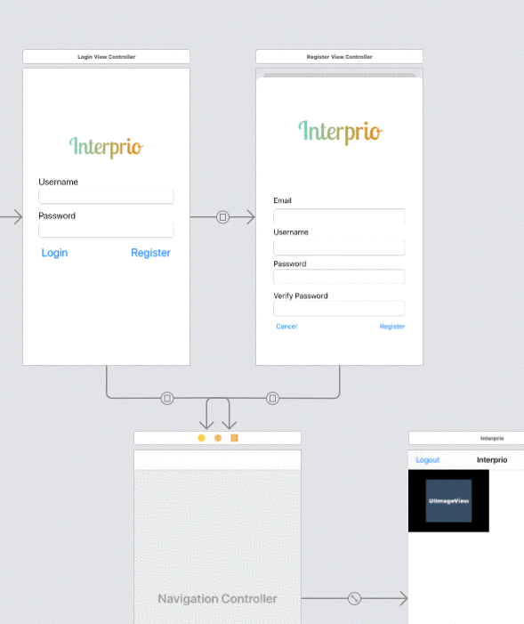
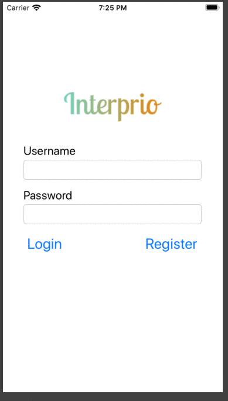
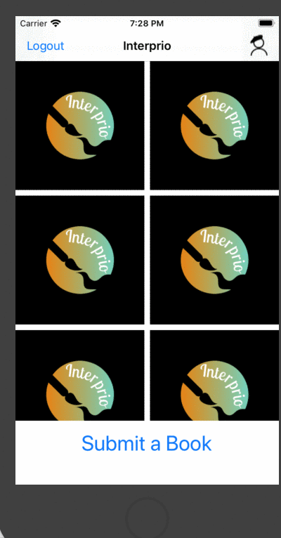

Group Project - README Template
===

# Interprio

## Table of Contents
1. [Overview](#Overview)
1. [Product Spec](#Product-Spec)
1. [Wireframes](#Wireframes)
2. [Schema](#Schema)

## Overview
### Description
An app that allows users to upload images and make their own story from that one image.

### App Evaluation
[Evaluation of your app across the following attributes]
- **Category: Art/Creativity**
- **Mobile: IOS**
- **Story: Allows users to upload images and create their stories from that one image**
- **Market: Anyone who enjoys character art and stories**
- **Habit: Users can enjoy stories**
- **Scope: Posting character art and making story comments **

## Product Spec

### 1. User Stories (Required and Optional)

**Required Must-have Stories**

* Login
* Register
* Stream
* Creation
* Profile

**Optional Nice-to-have Stories**

* Flipping (like a page) Genres/Topics
* Chat Room
* Story voting system
* 

### 2. Screen Archetypes

* Login
    * User can login
* Register
    * User can register a new account
* Stream
    * User can "scroll" down 
* Creation
    * User can upload an image
* Profile
    * User can showcase their uploads

### 3. Navigation

**Tab Navigation** (Tab to Screen)

* Profile
* Stream
* Creation
* Profile

**Flow Navigation** (Screen to Screen)

* Login
   * Stream
* Register
   * Stream
* Stream 
    * Profile
    * Creation
* Profile
    * Stream
## Wireframes
https://www.figma.com/file/hh5T3gI96g9CTW45m2tjcv/Interpo?node-id=0%3A1

### [BONUS] Digital Wireframes & Mockups

### [BONUS] Interactive Prototype

## Schema 

### Models

**User**
| Property | Type | Description |
| --------   | --------    | -------- |
| UserID  | String       | An ID that identifies user.|
| Email | String | The users email.|
|Password | String | string that will allow user to sign in|
|Profile_Picture | File | Users profile picture.|
|Date_Created | DateTime | Date user created account.|

**Book**
| Property | Type | Description |
| --------   | --------    | -------- |
| BookID       | String        |  An ID that indentifies the book (thread).    |
| Date_Created       | Date Time        | Date and time the book was created.     |

**Posts**
| Property | Type | Description |
| --------   | --------    | -------- |
| BookID      | String        | An ID that identifies the book. (Thread)     |
| PostID       | String      | Identifies the post object.     |
| UserID       | String       | Identifies who made the post.    |
| Comment       | String       | Comment add to post.    |
| Report       | Number        | User can make a report of a bad post.     |
| Likes_Count       | Number        | Total of likes.     |
| Date_Created       | DateTime        | Date the post was created.     |
| Post_Picture       | File        | The image attached to the post.    |

**Comments**
| Property | Type | Description |
| --------   | --------    | -------- |
| CommentID      | Number        | An ID that identifies the comment from the user     |
| UserID       | String       | Identifies User.     |
| Likes | Number | users who likes the comment. |
| Dislikes       | Number        | users who dislike the comment.     |
| Date_Created       | DateTime        | date the comment was posted.    |

**Post_Likes**
| Property | Type | Description |
| --------   | --------    | -------- |
| PostID      | Number       | An ID for the post from the user.     |
| UserID       | String        | An ID for the post from user.     |
| TypeOfLikes       | String        | Identifies whether it is a like or dislike.     |
| CategoryOfLike       | String     | Identifies where the like was made. Ex: Book like, Post Like, Comment Like     |

**Dislikes**
| Property | Type | Description |
| --------   | --------    | -------- |
| PostID      | String        | Identifies which post was disliked.    |
| UserID  | String       | Identifies user who disliked.     |
| TypeOfDislikes      | String        | Identifies where the dislike was made.    |

### Networking

- **Login Screen**
    (Read/GET)Validate Username and Password.
        let query = PFQuery(className:"User")
        query.whereKey("username", equalTo: currentUser)
        
- **Register**
    (Create/POST)Creates a user account.
        let query = PFQuery(classname: "Users")
        query.whereKey("userID", notEqualTo: usernametext)
        query. findObjectsInBackground { (users: [PFObject]?, error:         Error?) in
           if let error = error { 
              print(error.localizedDescription)
           } else if let posts = posts {
              print("Successfully retrieved \(posts.count) posts.")
              // TODO: Do something with posts...
           }
        }
    
- **Profile**
    (Read/Get) Query logged in user object.
        let query = PFQuery(classname: "User")
        query.whereKey("userID", EqualTo: currentUser)
        
    (Update/PUT) Update user profile image.
    Query logged in user object.
        let query = PFQuery(classname: "User")
        query.whereKey("userPic", EqualTo: currentUserPic)
        
    (Update/PUT) Update user profile likes/dislikes.
    Query logged in user object.
        let query = PFQuery(classname: "User")
        query.whereKey("likes", EqualTo: userLikes)
        let query = PFQuery(classname: "User")
        query.whereKey("dislikes", EqualTo: userDislikes)
- **Stream**
    (Read/GET) Query all submissions and display current submissions.
    let query = PFQuery(classname: "stream")
    query.whereKey("streamPosts", EqualTo: streamPosts)
- **Post Collection**
    (Read/GET)Query All current posts for the book.
       let query = PFQuery(classname: "book")
    query.whereKey("bookposts", EqualTo: streamPosts)
- **Creation**
    (Create/POST) Create a new Creation object.
    let query = PFQuery(classname: "user")
    query.whereKey("newPost", EqualTo: streamPosts)
- **Submit Cover**
    (Read/GET) Create a new Cover object.
    (Create/POST) Create a new Creation object.
    let query = PFQuery(classname: "user")
    query.whereKey("newCreation", EqualTo: creationPosts)
- [Create basic snippets for each Parse network request]

## Interprio DEMO

**Finished UX**

**Finished Database**

**Finished Logic**

**Production Ready**

